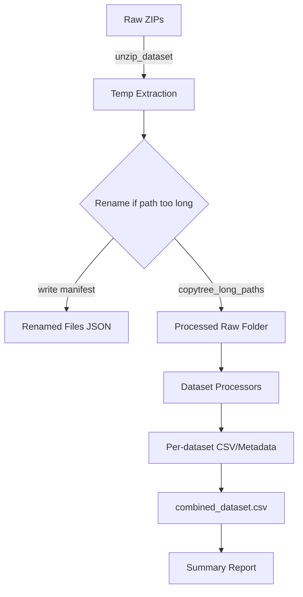

# Pipeline Overview

## Architecture



_For slide decks/screenshots_: place rendered diagrams or UI captures under `docs/images/` (example name: `pipeline_flow.png`) and reference them with standard Markdown (``).

```text
raw zip files ──> unzip_dataset (zip_utils)
                    │
                    ├─ long-path safe temp extraction
                    ├─ rename manifest for truncated filenames
                    └─ copytree_long_paths ──> data/processed/dataset/{Dataset}/

processed raw dirs ──> dataset processors (plantvillage|plantdoc|tomato_leaf)
                        │
                        ├─ label normalization & metadata
                        ├─ sequential image renaming
                        └─ CSV/JSON summaries

all processed CSVs ──> combined_dataset.csv + summary report
```

### Component Responsibilities

| Component | Responsibility |
|-----------|----------------|
| `pipeline/config.py` | Path resolution, CLI parsing, dataset selection. |
| `pipeline/fs_utils.py` | Long-path safe file operations (copy, remove). |
| `pipeline/zip_utils.py` | Incremental extraction, largest-folder detection, rename manifest. |
| `pipeline/plantvillage.py` | Normalize folder labels, generate CSV & metadata for PlantVillage. |
| `pipeline/plantdoc.py` | Merge train/test, normalize labels, generate CSV & metadata for PlantDoc. |
| `pipeline/tomato_leaf.py` | Copy raw images, YOLO annotations, metadata for Tomato Leaf dataset. |
| `process_datasets.py` | Orchestrates extraction, processing, combined CSV, console summary. |

### Data Flow

1. **Extraction**: Each selected dataset zip is extracted into `data/processed/dataset/{Dataset}`. A manifest (`{Dataset}_renamed_files.json`) lists files renamed for path-length reasons.
2. **Processing**: Dataset-specific modules read the extracted folders, rename images to sequential IDs, normalize labels, and emit per-dataset CSV + metadata.
3. **Aggregation**: `process_datasets.py` merges all CSV rows into `combined_dataset.csv` and prints cross-dataset statistics (class overlap, totals).

## Dependencies

Minimal runtime dependencies (see `requirements.txt`):

- `pillow` (if image inspection becomes necessary in future iterations).
- `pandas` or `polars` are purposely avoided to keep footprint small (CSV writing uses stdlib `csv`).

Unit tests rely on `pytest`.

## Deployment Notes

- Pipeline is Windows-first but works on WSL/Linux; long-path helpers no-op on POSIX.
- Re-running is safe; processors clear their outputs before writing new data.
- Consider running on SSD storage; extraction and copy operations are IO-bound.
